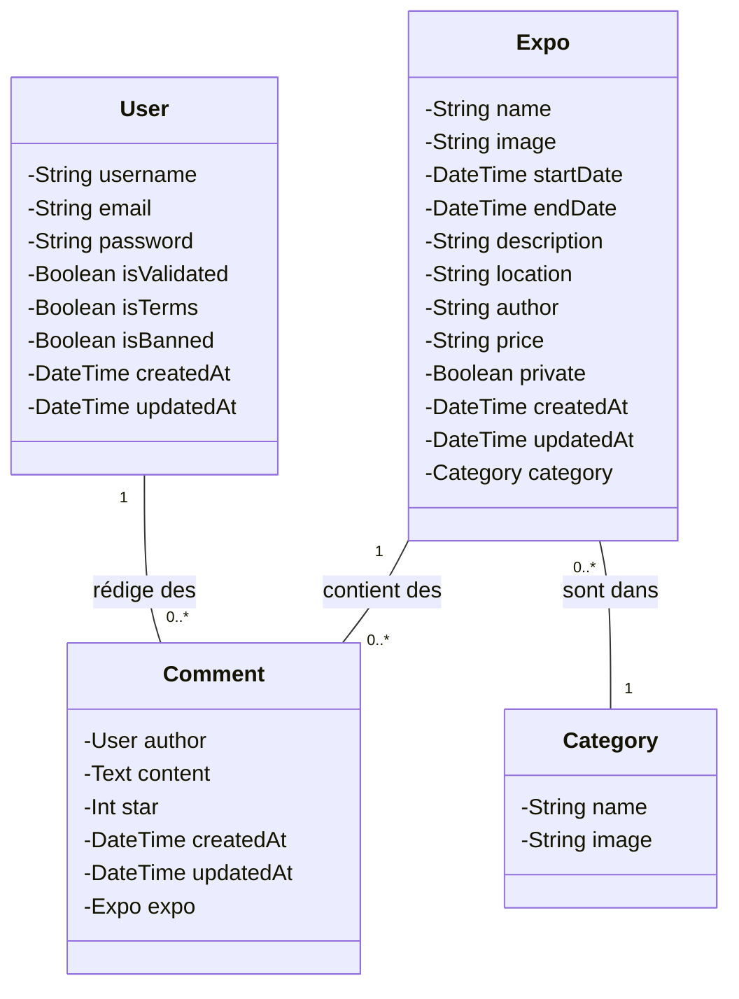

# Diagrammes de classes

Représentation des classes de l'application ExpoApp.

```mermaid

classDiagram
    class User {
        -String username
        -String email
        -String password
        -Boolean isValidated
        -Boolean isTerms
        -Boolean isBanned
        -DateTime createdAt
        -DateTime updatedAt
    }

    class Expo {
        -String name
        -String image
        -DateTime startDate
        -DateTime endDate
        -String description
        -String location
        -String author
        -String price
        -Boolean private
        -DateTime createdAt
        -DateTime updatedAt
        -Category category
    }

    class Category {
        -String name
        -String image
    }

    class Comment {
        -User author
        -Text content
        -Int star
        -DateTime createdAt
        -DateTime updatedAt
        -Expo expo
    }

User "1" -- "0..*" Comment: rédige des
Expo "1" -- "0..*" Comment: contient des
Expo "0..*" -- "1" Category: sont dans

```